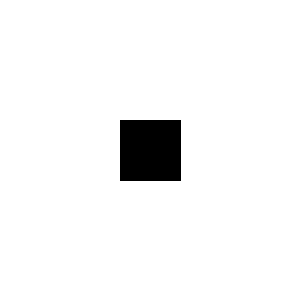
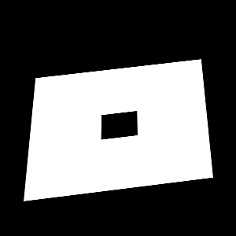

# 畸变原因

由相机高低角（也称为仰俯角）造成的图像畸变主要是指在拍摄时相机与被摄物体平面不垂直导致的视角变化。当相机向上或向下倾斜时，图像中的物体会出现透视扭曲。例如，当相机向下倾斜拍摄地面时，近处的物体会显得比远处的物体大，物体的形状和比例也会发生改变。这种畸变在航拍、建筑摄影等领域中尤为常见，理解和矫正这种畸变对于获取准确的图像信息非常重要。

# 解决方法

- 数学模型和算法：基于相机的内外参数矩阵，采用数学模型对图像进行变换和校正
- 深度学习方法：利用深度学习，学习畸变特征并自动进行矫正

## 数学方法
相机内外参解释可参考 [视觉slam十四讲](https://github.com/qomo/LearnSensorFusion/tree/master/books)

坐标系转换关系如下。其中，世界坐标系为局部坐标系且Zw为0，未有统一定义，需按照具体语境指定。

外参矩阵：描述世界坐标中的相机位置及其指向方向。向量t描述了世界坐标系原点在相机坐标系的位置，R代表了相机坐标系中世界坐标系轴的方向

对放置在高空的相机考虑小孔成像，则地面物点P(lng,lat,altitude)可探测器上成像为P(u,v)，如图所示：

由于载机、吊舱等姿态，会使成像产生畸变。左图为仿真正射投影，右图为仿真畸变图像。

举个🌰：

对世界坐标进行处理，使其转换为在图像分辨率内、按比例缩放的规范化坐标，保持长宽比例。

接下来确定映射关系：使用图像的四角像素坐标和它们对应的世界坐标来确定一个映射关系。这个关系可以通过计算一个变换矩阵来建立，这个矩阵通常被称为单应性矩阵（Homography Matrix）或几何校正矩阵。例如使用opencv计算：
cv2.findHomography(image_points, normalized_coords)

最后应用变换：使用计算出的单应性矩阵对整个图像进行变换。例如：
corrected_image = cv2.warpPerspective(image, H, (image.shape[1], image.shape[0]))

变换结果如图所示：

相机位置在空间的可视化？

## 深度学习方法

参考大神论文 [Blind Geometric Distortion Correction on Images Through Deep Learning](https://github.com/xiaoyu258/GeoProj)

# 地图制作

将几何校正后的图像贴图到地图上

1. 定时读取和更新图像
    - 定期检查文件夹中的新图像。（一个后端服务来实现文件夹的访问和图像列表的获取）
    check_new_images函数:
    检查一个文件夹中的新图片，并将这些图片按照时间顺序添加到一个队列中。如果文件名在 file_mod_times 字典中不存在，或者文件的修改时间比字典中存储的时间新，则更新字典中该文件的时间，并将文件路径和修改时间添加到 new_images 列表中。
2. 图像拼接
    - 在服务器端完成拼接处理，然后将拼接好的图像作为一个整体发送到前端进行显示。
    background_image_task函数：
      - 队列不为空时取图
      - 判断第i张图像与第i-1张图像重复度（按照>80,20-80,<20设为判断条件）
      - 满足阈值条件进行拼接，否则直接发送到前端显示
3. 优化内存和性能
    - 确保定期清理不再需要的图像数据和变量，以防止内存溢出。
4. 异常处理和日志记录
5. 显示最新的图像

